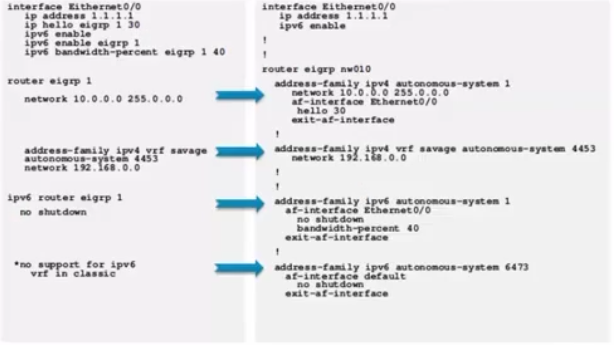

## see all messages (u all - to cancel)

```sh
debug eigrp packets
debug eigrp packets query
```

## block sending on the interface:

```sh
passive-interface eth0/1
```

## block sending on all:

```sh
router eigrp 90
 variance 2
 network 10.1.0.0 0.0.255.255
 network 172.30.0.0
 network 192.168.1.0
 passive-interface default ← 
 no passive-interface Serial2/0
 no passive-interface Serial2/1
!
```

## summary on EIGRP on the interface:

```
interface Serial2/1
 bandwidth 256
 ip address 10.1.34.1 255.255.255.252
 ip summary-address eigrp 90 172.30.0.0 255.255.248.0 ← 
 serial restart-delay 0
!
```

## loadbalance traffic with "variance" command:

```sh
router eigrp 90
 variance 2 ← 
 network 10.1.0.0 0.0.255.255
 network 172.30.0.0
 network 192.168.1.0
 passive-interface default
 no passive-interface Serial2/0
 no passive-interface Serial2/1
```

## split horizont change if only one interface is in game

```sh
conf t
router eigrp 25
no ip split-horizon eigrp 25
```

## utilize 30% more bandwidth

```sh
ip bandwidth-percent eigrp 25 80 (default 50%)
```

## configure authentication (check the clock)

```sh
conf t
key chain EIGRP_KEYS
key 1
key-string eigrp01
accept-lifetime 00:00:00 1 Jan 2020 00:00:00 30 Sep 2020
send-lifetime 00:00:00 1 Jan 2020 00:00:00 30 Sep 2020

key 2
key-string eigrp02
accept-lifetime 00:00:00 01 Nov 2020 infinite
send-lifetime 00:00:00 01 Nov 2020 infinite

int fa0/2
ip authentication mode eigrp 10 md5
ip authentication key-chain eigrp 10 EIGRP_KEYS
```

## EIGRP IPv6 configuration

```sh
conf t
ipv6 unicast-routing
ipv6 router eigrp 10
router-id 1.1.1.1
no shutdown
end
interface s2/0
ipv6 eigrp 10
end
```

## EIGRP named configuration

```sh
conf t
router eigrp NAMED
address-family ipv4 unicast autonomous-system 10
network 172.16.0.0 0.0.0.255
af-interface s2/0
passive-interface default
end

# or ipv6
conf t
router eigrp NAMED
address-family ipv6 autonomous-system 10
af-interface e0/1
end
```
### example

![[assets/images/cisco/eigrp-named.png]]


